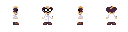

# README


<video src="https://github.com/user-attachments/assets/67908669-e253-4b2a-b792-5769ea251da1" controls autoplay loop muted style="max-width: 100%;"></video>


This app can be used to generate 3D voxel art based on a 2d pixel art sprite, or generate a fully 3d object
based on provided 4 sided pixel-art sprite sheet. The output can be saved as a .obj file which can be imported or used
with Blender, Unity, Godot or any other Game Engine or 3D Modelling software.

## Modes
the app supports various generation modes based on the type of sprite input;

- **Single**: Generates a 3D voxel representation based on a single 2D sprite image.
- **Single + Repeated**: Uses a single sprite and repeats it along the 4 sides, and extrudes by a specified depth scale.
- **Dual**: Uses a dual-perspective sprite sheet [FRONT,BACK] to generate the 3D model.
- **Quad**: Generates a full 360-degree 3D object using a 4-sided sprite sheet, used in this order; [LEFT, FRONT, RIGHT, BACK].

### Using Quad Mode
To use the **Quad** mode, you must input a sprite sheet containing 4 directional perspectives. 
The sprite sheet must be laid out horizontally in the following specific order:
1. **Left Side**
2. **Front**
3. **Right Side**
4. **Back**

**Important:** The artwork must be properly centered within each of the 4 faces in the sprite sheet to ensure proper alignment and symmetry when generating the 3D model.
**Note**: You should use animation frame feature of aseprite or similar pixel art editors to generate a horizontal spread sheet, that would be easier to work with.

Example Quad Sprite Sheet:


## Depth Scaling
Depth scaling controls the thickness and depth structure of the generated voxels along the Z-axis.

- **Default Scaling**: The default depth generation creates natural, rounded contours by calculating the thickness based on the sprite's silhouette. This works bethe depth axis to create a solid object.st for rounded or organic objects.
- **Biased Depth Scaling**: You should use biased depth scaling when your object has varying shapes or requires specific depth fine-tuning. This feature allows you to manually adjust (bias) the depth scale at the **top**, **middle**, and **bottom** sections of the sprite, giving you more precise control over the 3D geometry rather than relying solely on the default rounded interpolation.

## Download
Checkout https://github.com/GazPrash/2d-to-3d-voxelizer/releases

## Building
RUN the Build version via on MacOS/Linux:

```bash
wails build && {open/xdg-open} build/bin/pix2dTo3dApp.app
```
